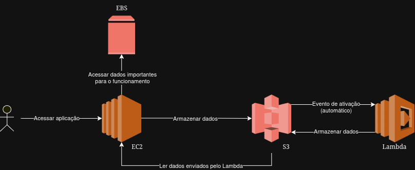

# ☁️ Gerenciando Instâncias EC2 na AWS

Repositório para consolidar meus conhecimentos no bootcamp **"GFT - Fundamentos de Cloud com AWS"**, da plataforma DIO, contendo anotações e insights adquiridos.

## Conceitos

* **Regions:** São grupos de, no mínimo, duas avaliability zones. Elas são separadas uma das outras para ter a maior tolerância a falhas possível. Para escolher a region certa, deve-se observar os custos, a latência, e se todos os serviços que serão necessários estão disponíveis.
* **Avaliability Zones:** São data centers independentes, conectados somente de forma lógica. A redundância entre elas é altíssima, pois são programadas para trabalharem de forma isolada no caso de falha.
* **Configuração de conta:** Algumas práticas de segurança necessárias para a conta: Criar a conta root e não compartilhar seu acesso, observar sempre os gastos e habilitar a autenticação de múltiplos fatores.
* **Instâncias EC2 (Elastic Compute Cloud):** Infraestrura como serviço de máquina virtual, composto de CPU, memória, SO e outras características dos computadores. É nela que a aplicação roda. Existem muitos tipos de instâncias diferentes, e deve ser observado os requisitos da aplicação para obter o melhor desempenho com o menor custo.
* **EBS (Elastic Block Storage)** Armazenamento do EC2, onde ficam salvos os todos dados relacionados a instância, como um HD/SSD de um computador.
* **S3 (Simple Storage Service):** O serviço de armazenamento do AWS. Diferente do EBS, aqui ficam salvos objetos, e não dados da instância EC2. Ele tem um ciclo de vida automático quando um dado fica mais do que 90 dias armazenado, migrando para a classe Glacier. 
* **Lambda:** Serviço que executa códigos sem a necessidade de uma máquina virtual. Diferente do EC2, ele só entra em atividade no momento que é solicitado, e encerra logo após.

## Desafio

Aplicar o conhecimento adquirido para criar uma arquitetura. Foi utilizado o software **draw.io**, que contém modelos do AWS e outras plataformas de nuvem para elaborá-lo.

